# MonitoreoNagios
## Installation
1. First we are going to need running our Virtual Machines, for that we use in directory root were we have the Vagrantfile the next command, it will take an average of 1 hour and half to install all the dependencies

`vagrant up`

2. After run the Virtual Machines we are going to access to the Nagios virtual machine, for that we use the next command

## Using project
`vagrant ssh nagios`

3. After access to the Nagios virtual machine we assert that the nagios service is running using the next command

`service nagios status`

4. Then we are going to use our ip of the Nagios virtual machine and use it in our internet navigator, if you dont have the ip of the Nagios virtual machine you can use the next command to get the ip of the Nagios virtual machine

`ifconfig`

5. In the navigator we should have a page like this one
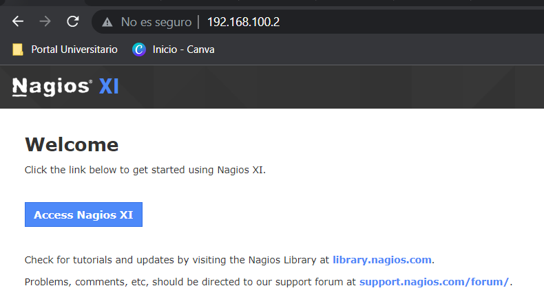

6. We'll have to set the initial configuration for nagios
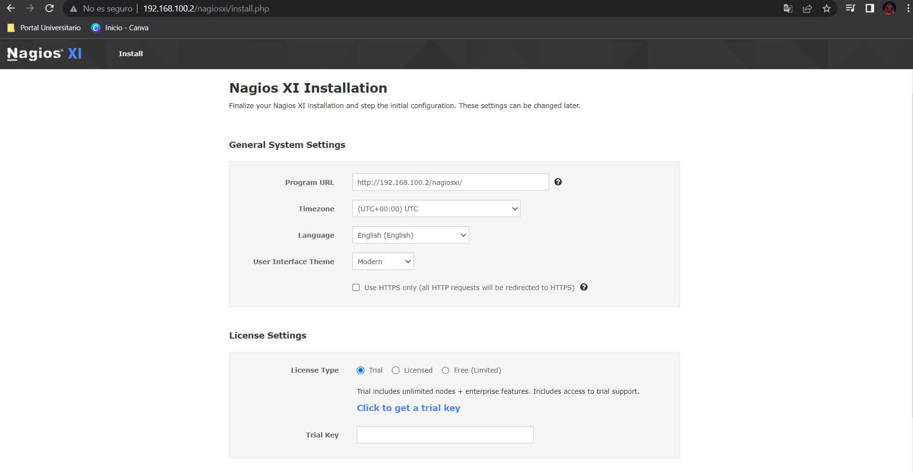
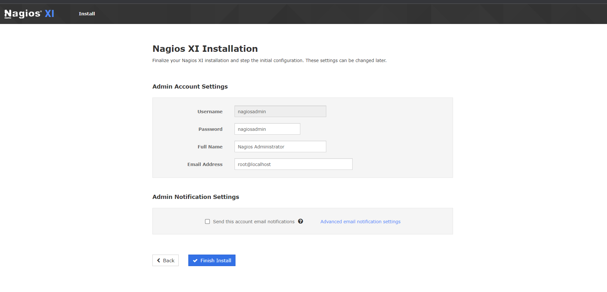

7. After that we are going to login in the Nagios page
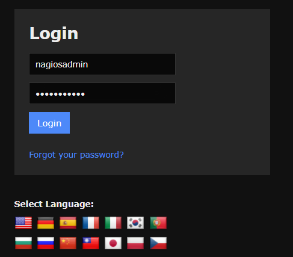

8. It will ask us to accept the terms of servie
9. The we will have a home dashboard for Nagios like the following one
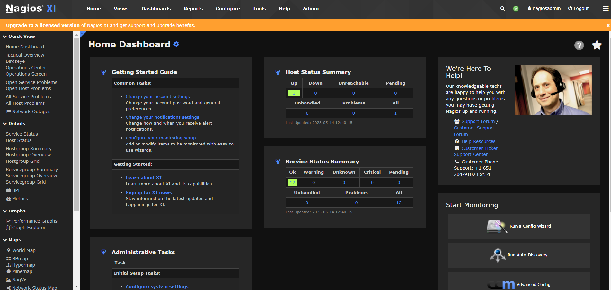

 we are goin to click en the navigator bar in 'Dashboards', then we're goin to be able to see our nagios virtual machine statistics
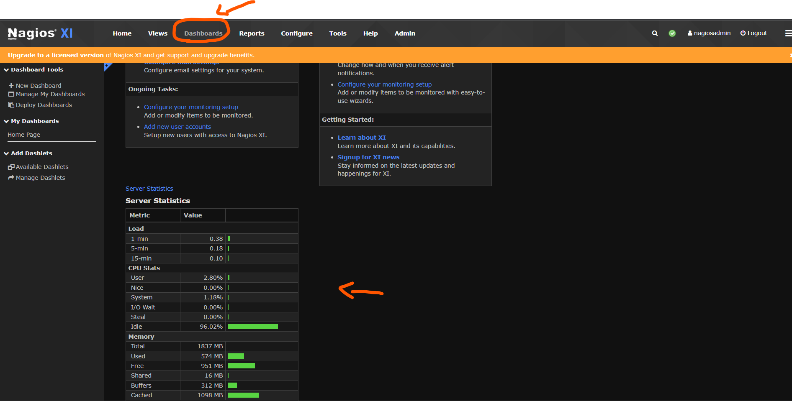
## Monitoring the Clients virtual machines with our Nagios virtual machine

10. Firt we'll need add the virtual machine that we want to monitor, for that in the navigation bar we go to the configure section and then go to the deploy section
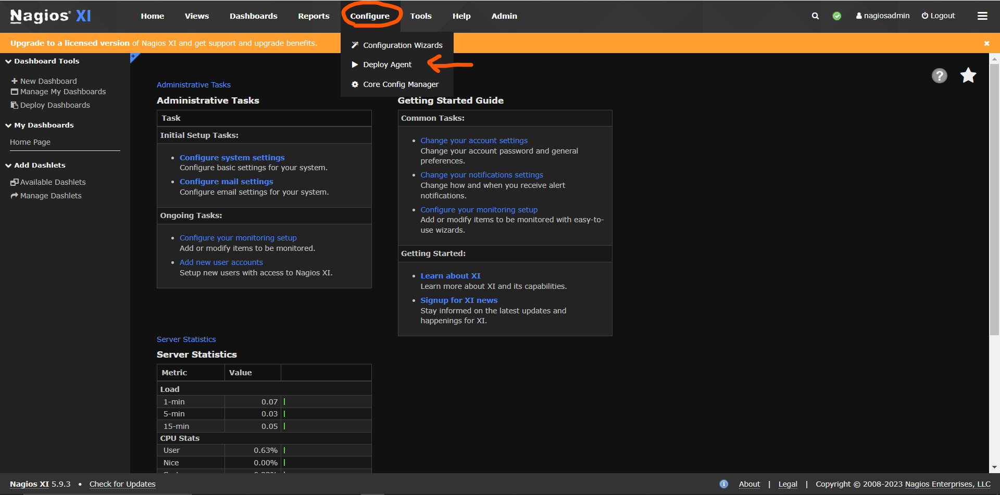

11. After that we are going to config and set the connection to the client virtual machine that we're adding
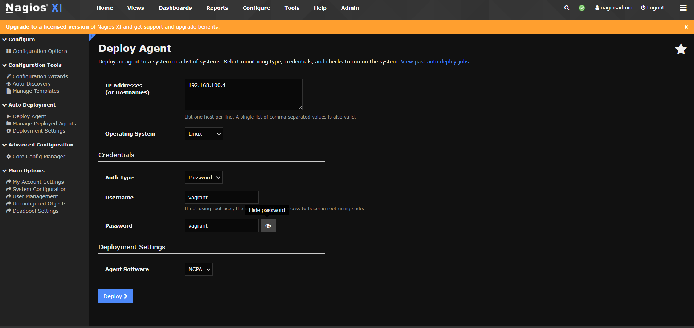
if we set right the connection to the client virtual machine the we'll have the next response
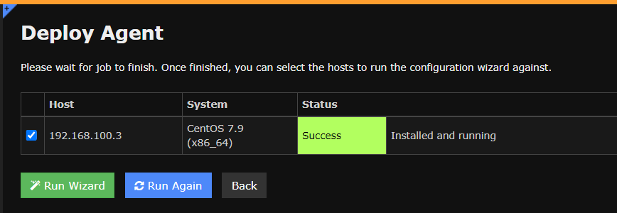

12. In the same screen of the last step we're going to click on 'Run Wizzard' and then we're going to set the params for the metrics of danger for that machine, the services that uses, the process and network to be monitoring by Nagios,

in our case we're going to check the network interface `eht1` wich we're connected to, then we select the service that the virtual machine has running and we are going to monitor, in this case is FTP `vsftpd`

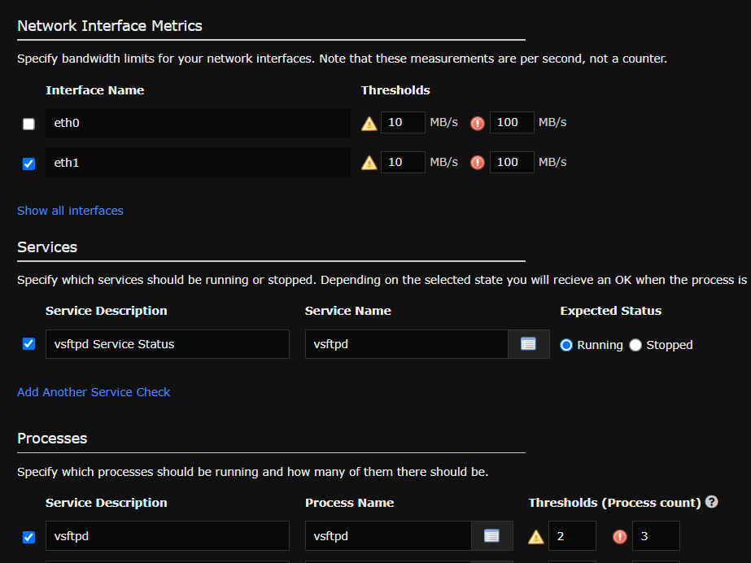

13. Then we set how often we're going to capture the data, in this case, each 6 seconds we're going to recieve the data

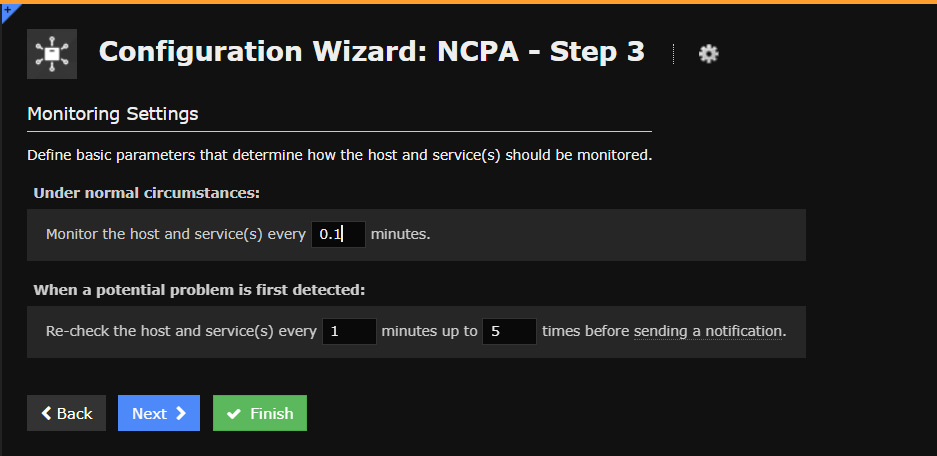

14. The NCPA - step 4 is setting for notifications to the metrics already configured, configure as you want
15. The NCPA - step 5 is to define Host groups, parent host and service groups, for this case we use the following configuration

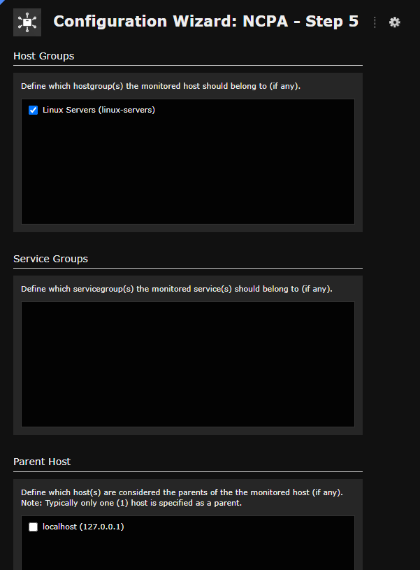

16. In the final step we are just going to Apply the settings
we should have the following message after that

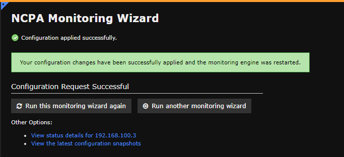

Done, you've a Virtual Machine being monitored

## Dashlet configuration
17. We select in the navigation bar the dashboard section, then in the lateral menu we select the option 'Available Dashlets', it'll show a lot of options, in this case we'll use BBMap, which allows us to know which services are available

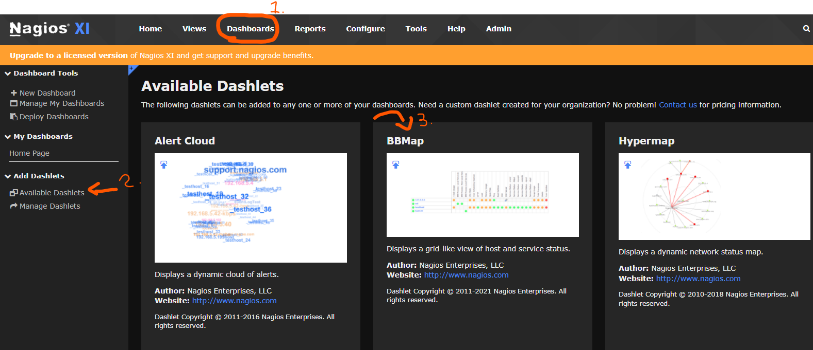

To add it to our Nagios administrator page, we will click on the upper right corner of the image of the BBMap, it says `Add this to a dashboard`
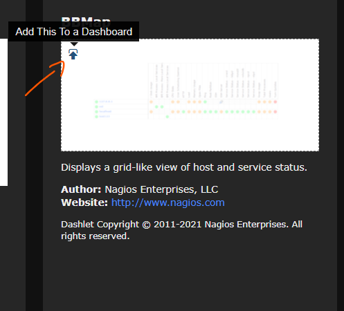

After that we go to the Home page in the lateral menu, we just organize the views and then we can see the active and inactive process
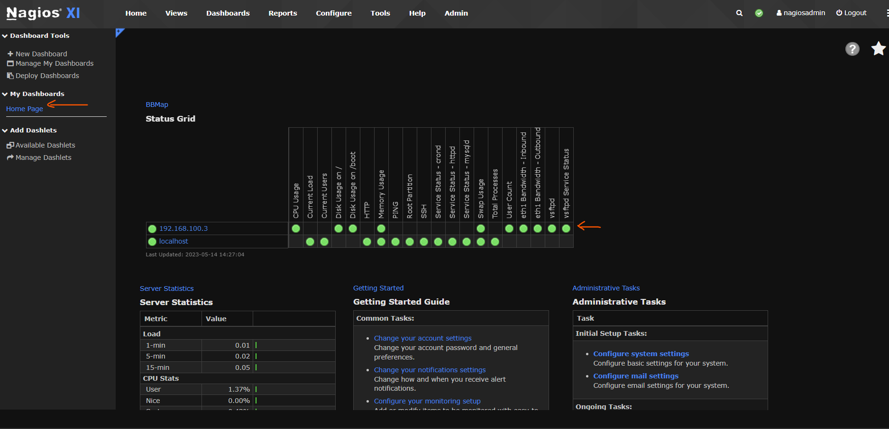

18. We can see the traffic by clicking on the ip address of the client virtual machine
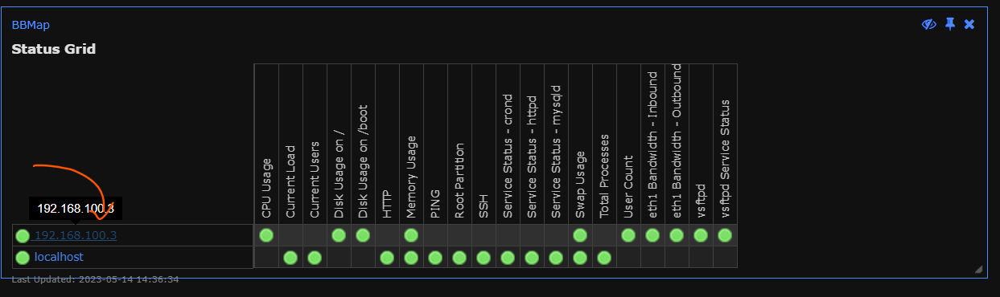
We can use the `Force an immediate check` in case we weren't receiving traffic
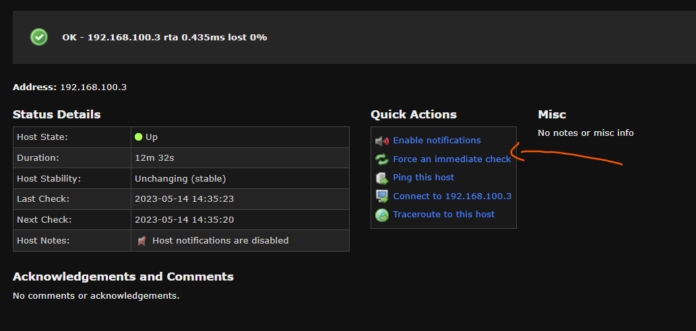

19. We go to performance graphs and the we see the traffic section by section
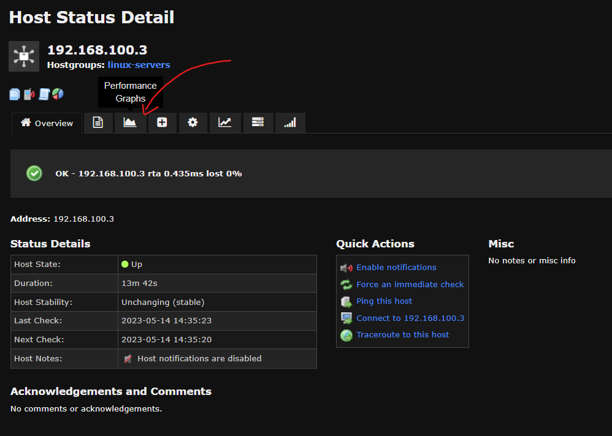

this is an example of performance graphs
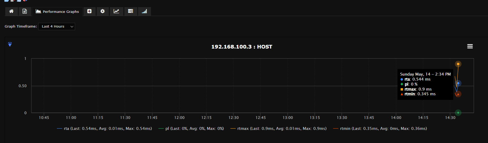

20. Repeat the steps if you want to add more client and different service to monitor